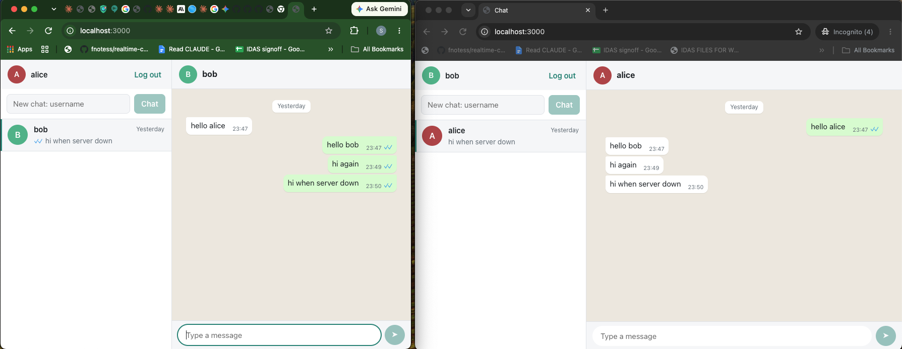
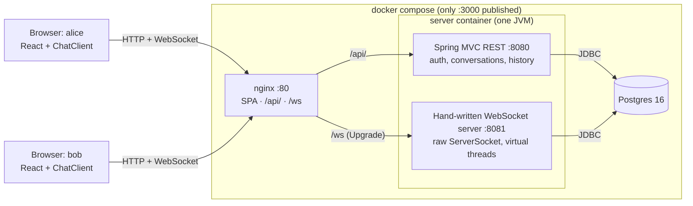
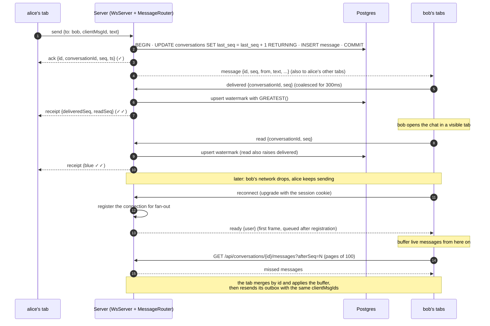

# realtime-chat

A real-time 1:1 messaging web app, like a small web WhatsApp: a Java 21 / Spring Boot backend with a
**hand-written WebSocket server**, Postgres, and a React client. One command runs it all.

## In plain English

Two people sign up, pick each other by username, and chat. Messages appear on the other person's
screen instantly, including in several tabs or devices at once, with ticks for sent, delivered and
read. Nothing gets lost or doubled: a message typed while offline waits and sends itself when the
connection comes back, and a refresh, a dropped network or a server restart picks up exactly where it
left off. What makes it unusual is that the part that carries messages in real time was written from
scratch rather than taken from a ready-made library, as the brief asked, and I tested it deliberately
against the awkward timing problems that make chat apps lose or repeat messages.



## Quick start

**Prerequisites:** Docker with Docker Compose v2. Nothing else: no JDK, Node or Postgres on the host.

```bash
docker compose up --build
```

The first build takes about 2 minutes; later starts take about 10 seconds. Then open
**http://localhost:3000** in a **normal window and a private (incognito) window**, and register a
different user in each.

Why two kinds of window: the login is an HttpOnly session cookie, and every window of one browser
profile shares the same cookies. Logging in as bob in a second normal window would log that whole
profile in as bob. A private window (or a second browser) has its own cookie jar.

Credentials are optional: copy `.env.example` to `.env` to set them. Without a `.env`, the stack uses
local-only defaults, which is acceptable only because the database port is never published.

### What to try in 60 seconds

1. **Chat.** As alice, type `bob` into "New chat" and send a message. It appears in bob's window
   straight away.
2. **Ticks.** alice sees ✓ (stored on the server), then ✓✓ (reached bob's browser), then blue ✓✓
   when bob opens the chat. If bob's tab is hidden, ✓✓ stays grey until that tab is visible again.
3. **Refresh** either window. You stay logged in, and the open chat and its history come back.
4. **Restart the server:** `docker compose restart server`. Both windows show "Reconnecting…" and
   recover on their own within a few seconds.
5. **Send while it's down:** `docker compose stop server`, send a message (it shows 🕓), then
   `docker compose start server`. It goes out once and arrives once.

## Features

- Sign-up and login with server-side sessions; logout also closes that session's open sockets.
- 1:1 conversations, a conversation list with previews and unread badges.
- Real-time delivery to every tab and device of both users.
- Sent / delivered / read ticks.
- Offline outbox: messages typed offline or during a reconnect are sent automatically, exactly once.
- Gap-free catch-up after any disconnect, and infinite scroll back through history.
- Reconnect with exponential backoff and jitter; a banner shows the connection state.
- Light and dark themes, and a single-column layout on narrow screens.

## Architecture



nginx is the only published port, so the page, the REST API and the WebSocket all share one origin
(http://localhost:3000). That keeps the session cookie simple: the cookie set by `/api/auth/login` is
sent on the `/ws` upgrade too, and that's how the socket is authenticated. Inside one JVM, Spring
serves REST on 8080, and my own WebSocket server listens on 8081 with a plain `ServerSocket` and one
virtual thread per connection. Spring only starts and stops it. Both sides call the same
`SessionService` for authentication and write to Postgres through plain SQL. Postgres is the source of
truth for messages, sequence numbers, receipts and sessions; the only in-memory state is the map of
who is connected where, which is why the app runs as a single node (see
[Path to production](#path-to-production)).

## What's hand-built and what uses libraries

The brief's rule: the core real-time messaging must be built by hand; libraries are fine elsewhere.

| Area | How | Where |
|---|---|---|
| WebSocket handshake (RFC 6455, `Sec-WebSocket-Accept`, Origin/cookie checks) | **Hand-built** | `ws/WsServer` |
| Frame parsing: masking, 3 length forms, fragmentation, size limits, UTF-8 validation | **Hand-built** | `ws/WsFrameReader` |
| Frame writing, per-connection write lock, close handshake, ping/pong | **Hand-built** | `ws/WsConnection` |
| Bounded per-connection send queues and writer threads (backpressure) | **Hand-built** | `ws/WsConnection` |
| Heartbeat: dead-peer and stuck-write detection, session expiry on open sockets | **Hand-built** | `ws/WsServer` |
| Connection registry and multi-tab fan-out | **Hand-built** | `ws/ConnectionRegistry` |
| Message protocol (JSON), routing, acks, errors | **Hand-built** | `ws/MessageRouter` |
| Ordering (per-conversation seq), idempotency, reconnect sync, receipts | **Hand-built** (plain SQL) | `messages/` |
| Client protocol: socket lifecycle, sync, outbox, receipts, backoff | **Hand-built**, no socket library | `client/src/chat/ChatClient.ts` |
| Session auth, Origin checks, rate limits, trusted-proxy client IP | **Hand-built** (no Spring Security) | `auth/`, `ClientIpResolver` |
| REST endpoints | Library: Spring MVC | `*Controller` |
| Database access, pooling, migrations | Library: `JdbcClient`, HikariCP, Flyway, pgjdbc | |
| JSON encoding | Library: Jackson 3 | |
| Password hashing | Library: `spring-security-crypto` (only `BCryptPasswordEncoder`) | |
| UI | Library: React 19, built by Vite | `client/src/components` |
| Reverse proxy and static files | Library: nginx | `client/nginx.conf` |

The browser's built-in `WebSocket` object is used on the client. There's no Socket.IO, STOMP, Spring
WebSocket or Netty anywhere, and no client-side state or socket libraries.

## Life of a message



The order on the server is always **persist → commit → ack → fan-out**. The ack means "durably
stored", never just "received".

## Key decisions and trade-offs

**Raw sockets on virtual threads.**
*Decision:* a `ServerSocket` with one virtual thread per connection, blocking reads with
`DataInputStream.readFully`. *Why:* the frame parser reads top to bottom like the RFC, with no
partial-frame state machine, and a blocked virtual thread costs a few KB, not an OS thread.
*Rejected:* NIO selectors (the same scalability, but a hand-written state machine for partial frames
and more places for bugs) and Netty or Spring WebSocket (ruled out by the brief).

**One locked `sendFrame()` per connection.**
*Decision:* every outbound frame goes through one method guarded by a `ReentrantLock`. *Why:* a frame
is several writes (header, then payload), and fan-out means other users' threads write to this
socket. Without the lock two frames interleave and every frame boundary after that is corrupt.
`ReentrantLock` rather than `synchronized`, because on Java 21 a virtual thread blocking inside
`synchronized` pins its carrier thread. *Rejected:* relying on stream-level locking, which covers a
single `write()`, not a whole frame.

**Bounded send queues.**
*Decision:* fan-out only does a non-blocking `offer()` into each connection's queue (256 frames), and
a per-connection writer thread drains it. A full queue closes that client with 1008; it catches up
from history when it reconnects. *Why:* one slow recipient (a phone on a bad network) must never
stall the sender or anyone else. *Rejected:* writing from the sender's thread (the slow reader blocks
the sender) and an unbounded queue (moves the problem into server memory).

**One heartbeat sweeper for all connections.**
*Decision:* a single thread checks every connection every 10s: ping after 30s idle, close 10s after
an unanswered ping, force-close a write stuck for over 10s, close sockets whose session has expired.
It never does I/O itself; pings go out on short-lived virtual threads. *Why:* TCP can't detect a peer
that vanished without a FIN (a sleeping laptop), and one loop is cheaper and more predictable than a
timer per connection. Time is `System.nanoTime` and injected, so tests move a fake clock instead of
sleeping. *Trade-off:* a dead peer is noticed within about 50s, not instantly.

**Per-conversation seq via `UPDATE … RETURNING`.**
*Decision:* `UPDATE conversations SET last_seq = last_seq + 1 … RETURNING last_seq`, in the same
transaction as the insert. *Why:* the row lock serializes senders within one conversation only, so
seqs are gapless and match commit order, and a client can ask for "everything after 41". *Rejected:*
`MAX(seq)+1` (two senders read the same max; swapping it in fails the 100-sender test with duplicate
keys) and a global sequence (gaps on rollback, and numbering can disagree with commit order, which
makes a sync skip messages).

**Idempotent `clientMsgId`.**
*Decision:* the client generates a UUID per message and `UNIQUE (sender_id, client_msg_id)` enforces
it. A retry is re-acked with the original id and seq and isn't fanned out again. If two identical
retries race, the loser's transaction rolls back (so it burns no seq) and it returns the winner's
row. *Why:* the client can resend anything that wasn't acked, without asking whether it was stored.

**Commit → ack → fan-out.**
*Why:* fanning out before commit could show a message that then rolls back; acking before commit
could promise a message that's lost. If storing fails, the sender gets `server_error` and no ack, and
retries safely with the same `clientMsgId`.

**The `ready` frame and subscribe-then-fetch.**
*Decision:* on reconnect the client waits for the server's `ready` frame, buffers live messages,
fetches everything after its last seq, and merges by id. *Why:* fetch-then-subscribe loses a message
committed between the fetch and the socket's registration. `onopen` isn't enough either, because the
server writes the 101 before it registers the connection. `ready` goes through the send queue, whose
writer only starts after registration, so it can't arrive early. *Trade-off:* some messages arrive
twice (live and fetched); the merge by id makes that harmless.

**Watermark receipts.**
*Decision:* one row per (conversation, user) holding "delivered up to N" and "read up to N", updated
with `ON CONFLICT … GREATEST(…)`. *Why:* one upsert covers any number of messages, and watermarks can
never move backwards, however receipts are duplicated or reordered across tabs and reconnects. Read
implies delivered (`CHECK read <= delivered`). *Rejected:* a row per message per recipient, which
doubles write volume. *Trade-off:* you can't mark message 5 read while 4 isn't, which is how people
read a chat anyway.

**Server-side sessions, not JWT.**
*Why:* logout has to really end a session, and a WebSocket is authenticated once and then lives for
hours, so logout must be able to find and close that session's sockets. A JWT can't be revoked
without a denylist, which is a session table again. Tokens are 32 random bytes; only their SHA-256
is stored. *Rejected:* Spring Security as well: the policy is two rules, and it couldn't cover the
non-servlet WebSocket port, so REST and the socket would check sessions in two different ways.

**Origin check against CSWSH.**
*Decision:* the WebSocket handshake checks `Origin` against an exact allowlist before it looks at
the cookie, and REST checks it on every non-GET. A missing Origin is rejected. *Why:* browsers don't
apply CORS to WebSockets and attach cookies to the upgrade whatever page opened it, so without the
check any site could open a socket as the logged-in user and read their messages. I confirmed this
from a real browser: a page on another port got 403 and never an open socket. `SameSite=Lax` alone
isn't enough, since another port on the same host is still "same site".

**`JdbcClient`, not JPA, for the message path.**
*Why:* the correctness lives in a handful of statements (`UPDATE … RETURNING`, `ON CONFLICT`,
`GREATEST`), and a reviewer can check the guarantees by reading them. In JPA, `UPDATE … RETURNING`
becomes load-modify-flush (the `MAX+1` race again), `ON CONFLICT` isn't expressible, and flush timing
decides where constraint violations surface.

**Keyset paging.**
*Decision:* `WHERE seq < :beforeSeq ORDER BY seq DESC LIMIT n` (and `seq > :afterSeq` for catch-up).
*Why:* every page is an index seek of the same cost, and pages don't shift when new messages
arrive. *Rejected:* `OFFSET`, which reads and discards every earlier row and repeats or skips rows as
new messages land. Non-members get 404, not 403, so conversation ids can't be probed.

**`ChatClient` outside React.**
*Decision:* all client protocol logic lives in one framework-free class with the socket, API,
storage, randomness and clock injected; React reads it with `useSyncExternalStore`. *Why:* every race
in the client lives in that code, and a plain class lets a test stage them frame by frame with a fake
socket and fake timers. That's how four client bugs were found. *Rejected:* protocol logic in hooks
and effects, and mirroring state into `useReducer` (two sources of truth).

## Obstacles I hit

Bugs I actually ran into, and how I found them:

| Bug | Found by | Fix |
|---|---|---|
| **Reconnect storm.** A DevTools Live Expression re-ran `new WebSocket(...)` every second, and the server accepted 950+ connections from one tab. | Manual testing ([#3](https://github.com/fnotess/realtime-chat/pull/3)) | A per-IP cap ([#4](https://github.com/fnotess/realtime-chat/pull/4)), later a per-user cap of 5, and client backoff with full jitter. |
| **bcrypt's 72-byte truncation.** `matches()` silently compares only the first 72 bytes, so a 72-byte password plus *any* suffix would log in. | Checking the library directly: a 73-byte password matched its 72-byte prefix's hash | Reject passwords over 72 UTF-8 bytes on register **and** login (login still runs a dummy bcrypt, for timing). |
| **`Set.contains(null)` throws.** Immutable sets throw on `contains(null)`, so a handshake with no `Origin` header crashed the handler instead of getting a 403. `AuthFilter` had the same bug. | The missing-Origin case in `handshakeFromOtherOriginGets403EvenWithValidCookie` | Null-check first, in both places. |
| **A password in the logs.** Spring logs Jackson's parse error, and that error quotes the input, so a double-encoded login body would have put the password in the server log. | Manual smoke test: the log showed part of a request body | An `HttpMessageNotReadableException` handler that returns 400 without logging; a test captures log output to prove it. |
| **Lost delivered receipt.** The client sent *either* `read` *or* `delivered`, assuming read covers delivered. With a hidden tab, delivered can be ahead, so it was dropped and the sender's tick stuck at ✓. | Scripted browser run, then reproduced in a unit test before fixing | Send both frames when delivered is ahead of read. |
| **nginx header inheritance.** A `location` that sets any `proxy_set_header` inherits none from the server block, so `/ws` silently lost `X-Forwarded-For`. | End-to-end verification of Docker | Repeat the headers in each location, with a comment saying why. |
| **Shutdown race.** A connection registering just as `stop()` began could close without ever getting its 1001. | An intermittently failing `stopSendsGoingAwayToEveryConnection` | That path sends the 1001 itself; the test then passed 25 runs in a row. |

Hazards I designed out before they bit, and proved with a test or a check:

- **Frame interleaving.** `concurrentSendsNeverInterleave` runs 16 threads × 500 sends and parses the
  output back. With the lock removed it failed 3 runs out of 3.
- **The gap before `ready`.** `fetchThenSubscribeWouldMissAMessage` reproduces the lost message of
  fetch-then-subscribe deterministically. The ordering of `ready` after registration is guaranteed
  by construction (the writer thread starts after registration); the test only catches a regression
  when the window is widened artificially, which I say plainly rather than claim test coverage.
- **Turkish-I locale.** Under a Turkish default locale, `"CONNECTION".toLowerCase()` contains a
  dotless `ı` and header lookups fail. Header names and usernames are lowercased with `Locale.ROOT`.
- **Per-IP limits turning global behind a proxy.** Behind nginx every client has nginx's IP, so one
  user's failed logins would block everyone. `ClientIpResolver` believes `X-Forwarded-For` only from
  nginx's fixed address, reading right to left. Checked live: 50 logins with forged headers all
  counted against one client, while another client behind the same nginx was unaffected.
- **Shell-form `ENTRYPOINT` swallowing SIGTERM.** In shell form `sh` is PID 1 and doesn't forward the
  signal, so Java is SIGKILLed and clients never get the 1001. The Dockerfile uses exec form;
  `docker compose restart server` shows the clean 1001 and an automatic reconnect.

## Testing

```bash
cd server && ./mvnw test   # 70 tests; needs a running Docker daemon (Testcontainers starts Postgres)
cd client && npm test      # 18 tests; Vitest, no DOM, no server needed
cd client && npm run build # type check + production build
```

- **Server (70):** WebSocket unit tests bind port 0 and drive a fake clock with manual sweeps, so
  there are no sleeps. Database and auth tests run against a real Postgres through Testcontainers,
  never the dev database, so they pass while a dev server is running. They include 100 concurrent
  senders getting seqs exactly 1..100, 16 simultaneous identical retries producing one row, 200
  concurrent receipts keeping the maximum, and the full reconnect-sync race.
- **Client (18):** `ChatClient` against a `FakeSocket` and an in-memory `FakeApi` with the server's
  paging rules, staging races frame by frame with fake timers.
- **Proving the tests can fail.** For each concurrency or safety test I broke the code on purpose,
  checked that a test failed, and restored it. Examples: `MAX(seq)+1` instead of `UPDATE … RETURNING`,
  removing the write lock, removing `GREATEST`, removing the Origin check or the logout re-check,
  storing the raw session token, applying live messages during a sync, resending with a fresh
  `clientMsgId`, the resolver trusting every peer. Two client mutations initially survived, so I
  tightened those tests until they failed. The full lists are in each PR.
- **Manual and scripted:** a 27-check headless browser run with two isolated sessions ([#9](https://github.com/fnotess/realtime-chat/pull/9)), and an end-to-end
  pass from `docker compose down -v` covering chat, ticks, refresh, restart and stop ([#10](https://github.com/fnotess/realtime-chat/pull/10)).

What isn't tested automatically: React components (the UI was checked by the scripted browser run,
not in a test suite), and the timing equality of the dummy bcrypt (a timing test would be flaky).
There's no CI pipeline yet.

## Known limitations

- **Single node only.** The connection registry, login rate limits and connection counts are in
  memory. `docker compose up --scale server=2` would store every message but deliver live only to
  users on the same node.
- **Plain http.** The session cookie isn't `Secure`, because `http://localhost` can't carry one.
- **Registration isn't rate-limited**, and a 409 on sign-up reveals that a username exists.
- **Delivered means "some device of the recipient"**, not every device.
- **Text only:** no attachments, editing, deletion, typing indicators or online presence.
- **No user search.** You start a chat by typing an exact username; an unknown name fails on the
  first send, since a "does this user exist?" endpoint would let anyone enumerate usernames.
- A message that fails permanently (e.g. unknown recipient) is shown with its error, but isn't kept
  across a refresh.
- The unread badge in one tab is cleared by another tab's read receipt only when it covers the last
  message; partial reads elsewhere aren't subtracted.
- The unread count is a live `count(*)` per conversation on each list request: fine at chat scale.
- Logging in again in the same browser leaves the previous session row valid until it expires (7 days,
  absolute).
- The JPA starter is still on the classpath although nothing uses entities, so `ddl-auto=validate`
  checks nothing. Flyway is the schema's only source of truth; the starter could be dropped.
- `dev.html` (the pre-React test page, served on :8080 in local dev only) is still in the repo.

## Path to production

- **Multi-node fan-out.** Publish each committed message to the other nodes (Redis pub/sub, or
  Postgres `LISTEN/NOTIFY` to avoid a new component) so each node delivers to its own sockets, with
  sticky sessions for the WebSocket at the load balancer. Sessions and messages already live in
  Postgres, so REST needs no stickiness. Move rate limits and connection counts to Redis.
- **TLS and Secure cookies.** Terminate TLS at the proxy, set `CHAT_AUTH_COOKIESECURE=true`, rename the
  cookie with the `__Host-` prefix, add the https origin to `CHAT_AUTH_ALLOWEDORIGINS`, and add HSTS.
  The client switches to `wss:` by itself. Add any load balancer in front of nginx to
  `CHAT_AUTH_TRUSTEDPROXIES`.
- **Observability.** Metrics (Micrometer/Prometheus): open connections, handshakes by result code,
  send-queue depth and 1008 closes, fan-out latency (commit to enqueue to write), ack latency, Hikari
  pending threads and connection wait time, heartbeat dead-peer and stuck-write counts. Structured
  logs keep the existing rule: ids, sizes and codes only, never message content. Tracing across
  REST and the socket.
- **Push notifications** (Web Push / APNs / FCM) for users with no open socket, driven from the same
  commit event as fan-out.
- **Attachments** via object storage (S3-compatible): the client uploads with a presigned URL and the
  message carries only a reference, so large bodies never cross the WebSocket.
- **End-to-end encryption.** The Signal protocol would stop the server reading messages, at the cost
  of server-side search, multi-device history (keys per device) and moderation. That's a product
  decision, not just an engineering one.
- **Data growth.** Partition `messages` by conversation hash or by time, keep the
  `(conversation_id, seq)` index local to each partition, and archive old partitions.
- **Backups and recovery.** Continuous WAL archiving with point-in-time recovery, regular restore
  drills, and a managed Postgres with a standby.
- **CI/CD.** Run both test suites and the image builds on every PR (Testcontainers works in CI with
  Docker available), scan images, and deploy with rolling restarts; clients already reconnect and
  catch up after a 1001.
- **Abuse controls.** Rate-limit registration and message sends per user, and add a handshake rate
  limit per IP on top of the concurrent cap.

## Legacy maintenance

The brief asks how this would be maintained over years. The main risk for a real-time app is that
old clients stay open for days while the server is redeployed, so compatibility has to be designed in.

- **Protocol versioning.** Add a protocol version to the handshake (a query parameter or
  `Sec-WebSocket-Protocol`) and echo it in `ready`. Within a version, changes are additive only: new
  message types and new optional fields. That already works today: the server reads frames as a
  JSON tree and ignores unknown fields, an unknown `type` gets an `unknown_type` error without
  closing the connection, and the client skips frame types it doesn't know. A breaking
  change gets a new version, and the server supports N and N−1 at the same time.
- **Old clients against a new server.** The server keeps accepting the previous version until
  metrics show its traffic is gone. A client that is too old gets a specific close code telling it to
  reload, the same way 4001 already tells it to go to login.
- **Database migrations: expand → migrate → contract.** Flyway migrations are append-only (an applied
  migration is never edited: its checksum would fail validation, which is why V1's outdated header
  comment is left alone). A change ships as: add the new column or table (compatible with the old
  code), deploy code that writes both and backfill, switch reads, and only in a later release drop
  the old column. Every step can run while the previous version of the server is still up.
- **`ChatClient` as the stable seam.** All protocol knowledge on the client sits in one class with a
  small public API (`send`, `openChat`, `loadOlder`…) and an immutable snapshot. The UI can be
  redesigned, or a mobile client written against the same class, without touching the protocol; and
  a protocol change is made and tested in one place, with the existing race tests as a safety net.
- **Deprecation.** Announce in the changelog, log and count use of the deprecated path, keep it for
  at least one release cycle, and remove it only once the counter is at zero.
- **Runbooks.** Short, tested procedures for: a DB failover (clients see `server_error`, retry with
  the same `clientMsgId`, and nothing is duplicated), a mass reconnect after a deploy (watch
  handshake rate and Hikari wait time), rotating DB credentials, restoring from backup, and force-
  logging-out a user (delete their session rows; their sockets close with 4001).
- **Keeping it readable.** The code comments explain *why* (races, edge cases, rejected options),
  and the PR descriptions record the reasoning and the mutation tests behind each phase, which is
  what a future maintainer needs most.

## Local development

```bash
# Postgres only, on 127.0.0.1:5432 (an explicit file, so the full stack never publishes the DB)
docker compose -f docker-compose.yml -f docker-compose.dev.yml up -d db

cd server && ./mvnw spring-boot:run        # REST on :8080, WebSocket on :8081
cd client && npm install && npm run dev    # http://localhost:5173, proxies /api to :8080
```

Open http://localhost:5173 in a normal and a private window. In dev the page's WebSocket connects
directly to `ws://<page hostname>:8081/`; the session cookie still reaches it, because cookies are
scoped by host, not port. Use the same host name throughout: `localhost` and `127.0.0.1` have
separate cookies. All server settings are `chat.ws.*` and `chat.auth.*` in
`server/src/main/resources/application.properties`.

## Repo structure

```
.
├── docker-compose.yml          # db, server, web (nginx); only :3000 published
├── docker-compose.dev.yml      # publishes Postgres on 127.0.0.1 for local dev
├── server/                     # Java 21, Spring Boot 4.1, package com.sithija.chat
│   ├── Dockerfile
│   └── src/main/
│       ├── java/com/sithija/chat/
│       │   ├── ws/             # hand-written WebSocket server: handshake, frames, heartbeat, routing
│       │   ├── messages/       # seq, idempotency, history, receipts (JdbcClient + plain SQL)
│       │   ├── auth/           # sessions, bcrypt, Origin checks, login rate limits
│       │   └── ClientIpResolver.java
│       └── resources/db/migration/   # Flyway V1..V3
└── client/                     # React 19 + Vite + TypeScript
    ├── Dockerfile, nginx.conf
    └── src/
        ├── chat/               # ChatClient (protocol core), api, protocol types, test fakes
        ├── state/              # ChatProvider + useSyncExternalStore hooks
        └── components/         # rendering only
```

## How AI was used

I built this with Claude Code as a pair programmer. I directed the architecture, the protocol design
and the trade-offs (for example subscribe-then-fetch with a `ready` frame, watermark receipts, and
sessions over JWT), and I set the working rules in [CLAUDE.md](CLAUDE.md): small reviewable changes,
comments that explain why, no dependency without a reason, and breaking the code on purpose to prove
each safety test can fail. Claude wrote much of the code and tests to those decisions; I reviewed
every change, ran the manual checks, and merged each phase as its own PR. I can explain and modify
any part of it.

## Guided tour

Each phase is one merged PR, and the descriptions carry the reasoning, edge cases and test evidence.
Reading them in order is the quickest way through the code.

1. [#1 WebSocket handshake](https://github.com/fnotess/realtime-chat/pull/1): raw `ServerSocket`, virtual threads, RFC 6455 upgrade.
2. [#2 Frame reader](https://github.com/fnotess/realtime-chat/pull/2): masking, length forms, fragmentation, limits checked before allocating, UTF-8.
3. [#3 Frame writer](https://github.com/fnotess/realtime-chat/pull/3): the locked `sendFrame()`, ping/pong, close handshake, the interleaving test.
4. [#4 Heartbeat](https://github.com/fnotess/realtime-chat/pull/4): one sweeper, dead peers, stuck writes, graceful shutdown, per-IP cap.
5. [#5 Routing](https://github.com/fnotess/realtime-chat/pull/5): connection registry, JSON protocol, multi-tab fan-out, bounded send queues.
6. [#6 Persistence](https://github.com/fnotess/realtime-chat/pull/6): per-conversation seq, idempotent retries, keyset-paged history.
7. [#7 Auth](https://github.com/fnotess/realtime-chat/pull/7): server-side sessions on REST and the upgrade, Origin checks, logout closes sockets.
8. [#8 Sync and receipts](https://github.com/fnotess/realtime-chat/pull/8): the `ready` frame, subscribe-then-fetch, outbox resend, watermark receipts.
9. [#9 React client](https://github.com/fnotess/realtime-chat/pull/9): `ChatClient` protocol core, the UI, offline outbox, history paging.
10. [#10 Docker](https://github.com/fnotess/realtime-chat/pull/10): one-command stack, nginx single origin, trusted-proxy client IP, clean shutdown.
